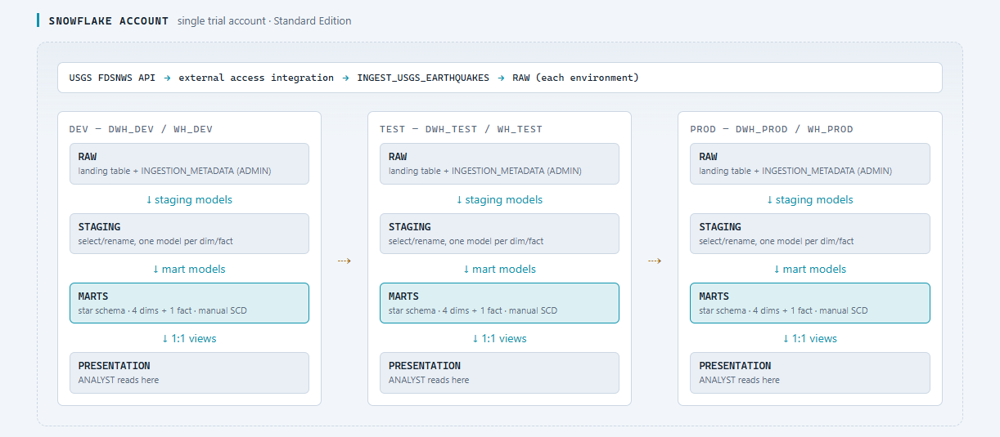
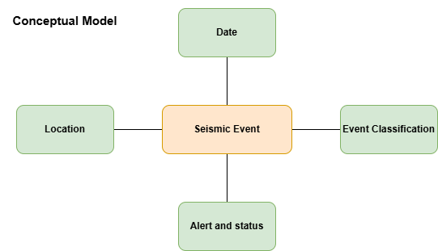
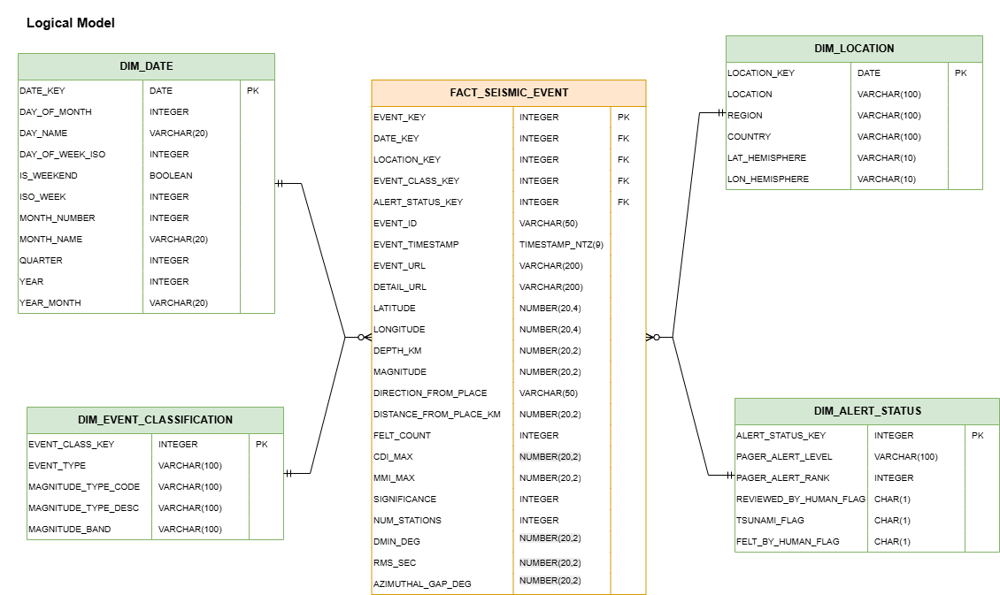
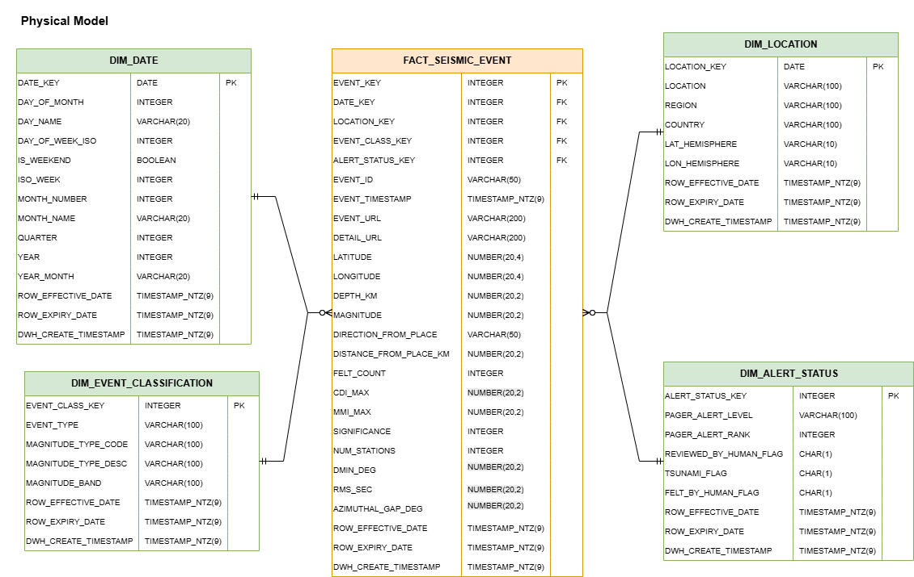
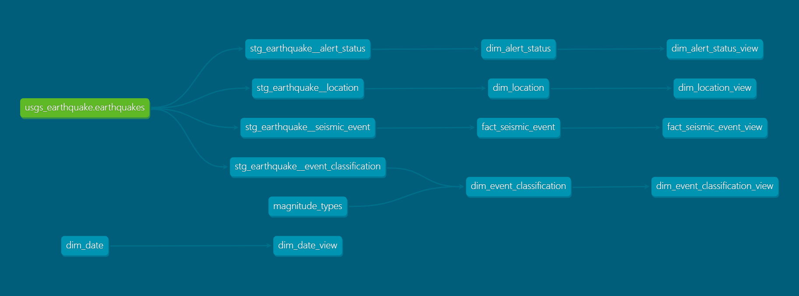

# snowflake_sandbox

A practice project for Terraform, dbt, data modelling, CI/CD and Snowflake.

- **Terraform** provisions account-level objects — databases, schemas, roles, and warehouses.
- **dbt** builds the models (staging/marts/presentation) on top of those objects.
- The single permitted Snowsight actions are the one-time registration of an RSA public key for key-pair auth and for the creation of service accounts (for Terraform and dbt runs).
- For Snowflake objects not yet managed by Terraform (tables, seed DML, network rules, external access integrations, and Python stored procedures), SQL/Python scripts are maintained in the `scripts/` directory, grouped by object type (`ddl/`, `dml/`, `network/`, `procs/`). 

---

## Overview

This project extracts, loads and transforms USGS Earthquake data into a conformed dimensional model with presentation views built on top.
The data source provides a public REST API which was used to extract JSON data regarding global earthquakes. Filters were applied to only
return results since the start of 2026 which a magnitude of at least 5 on the Richter scale - this decision was made to limit the amount
of data being processed to avoid using unnecessary credits on a trial Snowflake account.

A Snowpark-based stored proc is used to ingest the data from the API into landing tables in the RAW schema. As this project is only intended
to be run on an ad-hoc basis, not on a fixed schedule, no specific orchestration tool has been included to initiate end-to-run runs. Instead,
the ingestion process is kicked off by a dbt on-run-start hook which calls the stored proc at the beginning of each dbt build command.

API documentation: https://earthquake.usgs.gov/fdsnws/event/1/

## High Level Architecture

The project follows a straightforward bronze -> silver -> gold -> platinum architecture, where platinum is defined as the presentation layer housing only views. The views have a 1:1 mapping to the modelled tables in the marts schema.

3 environments are configured: dev, test and prod. Any changes to either dbt or Terraform modules are deployed up these environments using CI/CD workflows made possible by GitHub actions.




## Project structure

```text
.
├── terraform/                  # Infrastructure as code — Snowflake account objects
│   ├── README.md               # Full Terraform guide (modules, HCP workspaces, apply order)
│   ├── modules/                # Reusable building blocks
│   │   ├── database/           #   a database + its RAW/STAGING/MARTS/PRESENTATION/ADMIN schemas
│   │   ├── warehouse/          #   a warehouse with size/auto-suspend settings
│   │   ├── role/               #   account-level custom roles (ENGINEER, ANALYST)
│   │   └── grants/             #   privilege grants + role-to-user memberships
│   └── environments/           # One directory + one HCP workspace per environment
│       ├── account/            #   account-wide objects (custom roles) — apply FIRST
│       ├── dev/                #   DWH_DEV database + WH_DEV warehouse + grants
│       ├── test/               #   DWH_TEST database + WH_TEST warehouse + grants
│       └── prod/               #   DWH_PROD database + WH_PROD warehouse + grants
├── dbt/                        # dbt project
│   ├── dbt_project.yml         # Model + seed configs (schemas, materializations, column types)
│   ├── profiles.yml            # Reads credentials from env vars (safe to commit)
│   ├── packages.yml            # dbt_utils
│   ├── macros/                 # generate_schema_name override + ingest_usgc_earthquakes (on-run-start hook)
│   ├── seeds/                  # magnitude_types.csv lookup
│   └── models/
│       ├── staging/            # source defs + staging models over the RAW USGS landing table
│       ├── marts/              # star schema: 4 dimensions and one fact table
│       └── presentation/       # 1:1 views over each mart, exposed to the ANALYST role
├── scripts/                    # SQL/Python for objects not yet managed by Terraform
│   ├── ddl/                    #   table definitions (ingestion metadata, USGS landing + staging)
│   ├── dml/                    #   seed/merge data (e.g. INGESTION_METADATA config rows)
│   ├── network/                #   network rules + external access integration (USGS API egress)
│   └── procs/                  #   Python stored procedures (USGS earthquake ingestion)
├── docs/                       # Data model diagrams
│   ├── earthquake_model.drawio #   draw.io source for the model diagrams below
│   ├── dbt-dag.png             #   dbt DAG (source -> staging -> marts -> presentation)
│   └── model/                  #   conceptual/logical/physical_model.png, exported from the drawio file
├── .github/
│   └── workflows/
│       ├── terraform.yml       # PR (terraform/** changed): fmt/validate/plan (all envs, posted to PR)
│       │                       # merge: gated apply (account -> dev -> test -> prod)
│       ├── ci.yml              # PR: ruff lint + format check
│       └── dbt.yml             # merge (dbt/** changed): gated dbt build (dev -> test -> prod)
├── .env.example                # Credential template — copy to .env (gitignored)
└── pyproject.toml
```

**State and secrets** are deliberately kept out of git. Terraform state lives in **HCP Terraform**
(one workspace per environment; see `terraform/README.md`), configured with **Local execution
mode** so runs happen on your machine and can read the local key file. Machine-specific connection
values are supplied locally via a gitignored `terraform.tfvars` or `TF_VAR_*` environment
variables — never committed. The private key file (`rsa_key.p8`) is gitignored and kept outside
the repo.

---

## Roles and Users

### Custom Roles

For simplicity in a sandbox environment, the below roles have access across all database environments. In a real-world scenario, there might be a separate role generated per environment to give finer grained permissions.

- ENGINEER - read/write across across all schemas.
- ANALYST - read access only in the `PRESENTATION` schema.
- DBT_TRANSFORMATIONS - usage on all schemas, varying privileges depending on schema. 

The roles themselves are created once in the **`account`** environment; each of `dev`/`test`
then grants those roles privileges on its own database and assigns them to users.

### Users

Two new Snowflake users have been created to allow automated jobs to run remotely:

- TERRAFORM_USER - used to create/destroy Terraform resources.
- DBT_USER - used to execute dbt commands (e.g. dbt build in CI/CD jobs).

Both users have been configured with RSA public keys to facilitate key-pair authentication.

---

## Data model

`docs/earthquake_model.drawio` is the editable source; the PNGs below are exported from it and
mirror the dbt marts one-for-one.

| Conceptual | Logical | Physical |
| --- | --- | --- |
|  |  |  |

`docs/dbt-dag.png` is the dbt lineage graph (`dbt docs generate` + `dbt docs serve`, or the DAG
tab of a `dbt docs` site) showing the same shape end to end — source → staging → marts →
presentation:



---

## dbt data model

dbt builds a star schema on top of the USGS earthquake data that lands in `RAW`. The layers:

- **Sources** (`models/staging/_src_earthquake.yml`) — declares `usgs_earthquake.earthquakes`
  over `RAW.USGS_EARTHQUAKES_FDSNWS`, with a freshness check.
- **Staging** (`models/staging/`) — thin models that select and rename source columns, one per
  downstream dimension/fact:
  - `stg_earthquake__event_classification` — `TYPE`, `MAGTYPE`, `MAG`, `TIME`.
  - `stg_earthquake__location` — `PLACE`, `LATITUDE`, `LONGITUDE`, `TIME`.
  - `stg_earthquake__alert_status` — `ALERT`, `STATUS`, `TSUNAMI`, `FELT`, `TIME`.
  - `stg_earthquake__seismic_event` — the full event grain: identifiers, location, magnitude,
    depth, and impact metrics, used to build the fact table.
- **Marts** (`models/marts/`) — a star schema, one row per current record in each case:
  - `dim_date` — calendar dimension generated with `dbt_utils.date_spine`.
  - `dim_event_classification` — event type, magnitude method, and a qualitative magnitude band
    (Moderate … Extreme).
  - `dim_location` — region/country extracted from the free-text place via `AI_EXTRACT`,
    hemispheres from latitude/longitude, and an SCD Type 1 effective/expiry pattern.
  - `dim_alert_status` — PAGER alert level/rank, human-review flag, tsunami flag, and
    felt-report flag, also SCD Type 2.
  - `fact_seismic_event` — one row per `EVENT_ID`, with foreign keys to all four dimensions
    (hashed from the same attributes each dimension is keyed on) plus event-level metrics
    (magnitude, depth, felt/CDI/MMI, station counts, etc.); an SCD Type 1 pattern mirrors
    the dimensions' effective/expiry columns.
  - All surrogate/foreign keys use `dbt_utils.generate_surrogate_key`.
- **Presentation** (`models/presentation/`) — a 1:1 view over every mart (e.g.
  `dim_location_view`, `fact_seismic_event_view`), materialized so the read-only `ANALYST` role
  only ever grants against `PRESENTATION`, never the underlying `MARTS` tables.

Supporting pieces:

- **Ingestion is triggered by dbt itself** — an `on-run-start` hook
  (`dbt_project.yml` → `macros/ingest_usgc_earthquakes.sql`) calls the
  `INGEST_USGS_EARTHQUAKES` stored procedure at the start of every `dbt build`, so a build always
  runs against freshly ingested data without a separate manual/scheduled step.
- **Seeds** — `seeds/magnitude_types.csv`, a magnitude-code → description lookup.
- **Packages** — `dbt_utils` (`date_spine`, `generate_surrogate_key`, `accepted_range`).
- **Schema naming** — a custom `macros/generate_schema_name.sql` makes `+schema` use the
  configured name verbatim, so models land in `STAGING`/`MARTS`/`PRESENTATION` (not
  `<target>_<schema>`).
- **Tests** — generic tests (`not_null`, `unique`, `accepted_values`, `relationships`,
  `dbt_utils.accepted_range`) in the `_*.yml` property files, plus dbt **unit tests** covering the
  trickier derivations (magnitude-band boundaries, alert-status flag derivation, and the
  direction/distance regex parsing in `fact_seismic_event`).

Build everything (models, seeds, tests) with `dbt build` — see step 6 below.

---

## Setup instructions

### 1. Tools

| Tool | Install (Windows) |
| --- | --- |
| Python 3.12 + `uv` | `pip install uv` |
| Terraform | `winget install Hashicorp.Terraform` (then reopen the shell so it's on `PATH`) |
| OpenSSL | `winget install ShiningLight.OpenSSL` |

Verify with `terraform -version` and `openssl version`.

You also need a free **HCP Terraform** account for remote state — see `terraform/README.md`.

### 2. Python environment

```powershell
uv venv
.venv\Scripts\activate
uv sync
```

### 3. Configure credentials

```powershell
Copy-Item .env.example .env
```

Edit `.env`. Find your account identifier in Snowsight under **Admin → Accounts** — it has
the form `orgname-accountname`. During first-time setup (before key-pair auth exists) you may
set `SNOWFLAKE_PASSWORD`; remove it once key-pair auth is working.

### 4. Set up key-pair auth and the Terraform service user

Terraform authenticates as a dedicated **`TERRAFORM_USER`** service account using an RSA
key pair — not your personal login.

**Generate the key pair** (keep `rsa_key.p8` outside the repo, e.g. one directory up):

```powershell
openssl genrsa 2048 | openssl pkcs8 -topk8 -nocrypt -out rsa_key.p8
openssl rsa -in rsa_key.p8 -pubout -out rsa_key.pub
```

**Register it and create the service user.** Open `rsa_key.pub` and copy the base64 body
**between** (and excluding) the `-----BEGIN/END PUBLIC KEY-----` lines, then run this once in a
Snowsight worksheet (the single permitted Snowsight operation):

```sql
USE ROLE ACCOUNTADMIN;

CREATE USER IF NOT EXISTS TERRAFORM_USER
    TYPE = SERVICE
    COMMENT = 'Service user for provisioning Snowflake via Terraform'
    RSA_PUBLIC_KEY = '<paste bare public key body here>';

-- SYSADMIN creates databases/schemas/warehouses; SECURITYADMIN creates roles and grants.
GRANT ROLE SYSADMIN TO USER TERRAFORM_USER;
GRANT ROLE SECURITYADMIN TO USER TERRAFORM_USER;
```

Verify with `DESC USER TERRAFORM_USER;` — the `RSA_PUBLIC_KEY_FP` row should be populated.

> **Troubleshooting `JWT token is invalid`:** the fingerprint registered on the user must
> match the private key Terraform uses, and `user`/`role` in `terraform.tfvars` must name the
> service user and a real role. Compute the local key's fingerprint and compare it to
> `RSA_PUBLIC_KEY_FP` from `DESC USER`:
>
> ```bash
> echo -n "SHA256:"; openssl pkey -in rsa_key.p8 -pubout -outform DER \
>   | openssl dgst -sha256 -binary | openssl enc -base64
> ```

### 5. Provision with Terraform

Full details — including the one-time HCP workspace creation, connection variables, and the
required apply order — live in **[`terraform/README.md`](terraform/README.md)**. In short:

```powershell
terraform login                       # once: authenticate the CLI to HCP Terraform

cd terraform\environments\account     # apply the ACCOUNT env first (creates the roles)
terraform init
terraform apply

cd ..\dev                             # then each database environment: dev, test, prod
terraform init
terraform apply
```

`account` must be applied before `dev`/`test`/`prod`, because those environments grant the roles
the `account` environment creates. Re-running `plan` afterward should report **No changes**.

You don't have to run these by hand: **`.github/workflows/terraform.yml`** plans all environments
on every PR (posting the plan as a PR comment) and, on merge to `main`, applies them in order
(`account → dev → test → prod`) behind GitHub Environment approval gates. See
[`terraform/README.md`](terraform/README.md) for the CI/CD details and required secrets.

### 6. Run dbt

dbt reads its connection settings from environment variables but does **not** load `.env`
itself. Load it with `uv run --env-file` so the variables are present in dbt's process:

```powershell
uv run --env-file .env dbt debug --project-dir dbt --profiles-dir dbt
uv run --env-file .env dbt build --project-dir dbt --profiles-dir dbt
```

Alternatively, set environment variables in your terminal - these can be reused across different sessions
so keep your commands more concise. You can also `cd` into the dbt directory to call dbt commands
directly from there.

`dbt debug` confirms the profile resolved and the connection works before you build anything.
Select the environment with `DBT_TARGET` (`dev` | `test` | `prod`) in `.env`, or override per
command with `--target` (use `prod` with care):

```powershell
uv run --env-file .env dbt build --project-dir dbt --profiles-dir dbt --target test
```

### 7. GitHub Actions secrets and branch protection

`terraform.yml` and `dbt.yml` authenticate as **different** Snowflake users, so they read
**different** secrets (**Settings → Secrets and variables → Actions**):

| Secret | Used by | Value |
| --- | --- | --- |
| `TF_API_TOKEN` | `terraform.yml` | HCP Terraform API token, so the `cloud {}` block can reach remote state |
| `TERRAFORM_PRIVATE_KEY` | `terraform.yml` | Base64-encoded `rsa_key.p8` for `TERRAFORM_USER` |
| `SNOWFLAKE_ORG` | `terraform.yml` | Organization half of the account identifier |
| `SNOWFLAKE_ACCOUNT_NAME` | `terraform.yml` | Account half of the account identifier |
| `SNOWFLAKE_ACCOUNT_IDENTIFIER` | `dbt.yml` | Full account identifier (`orgname-accountname`) |
| `DBT_SERVICE_ACCOUNT` | `dbt.yml` | Snowflake user dbt connects as (`ENGINEER` role) |
| `DBT_USER_PRIVATE_KEY` | `dbt.yml` | Base64-encoded `rsa_key.p8` for the dbt user |

`terraform.yml` never uses the dbt user's secrets and vice versa — see
`terraform/README.md` for why `TERRAFORM_USER` must not be overwritten in CI.

Encode a key for any of the base64 secrets above:

```powershell
[Convert]::ToBase64String([IO.File]::ReadAllBytes("rsa_key.p8")) | Set-Clipboard
```

Then protect `main` under **Settings → Branches → Add rule**: require a pull request and
require the `lint` status check (from `ci.yml`) to pass before merging. Note `dbt.yml` only runs
**after** a merge (push to `main`, gated per environment) — there is currently no PR-time dbt
build/compile check; see the "Next / ideas to explore" list in `CLAUDE.md`.
